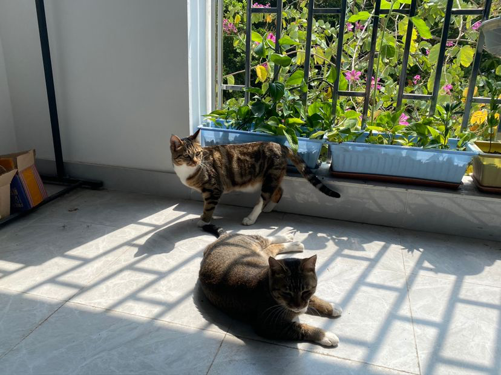
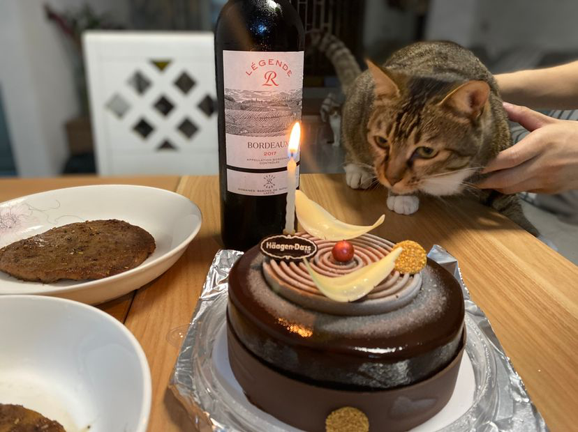
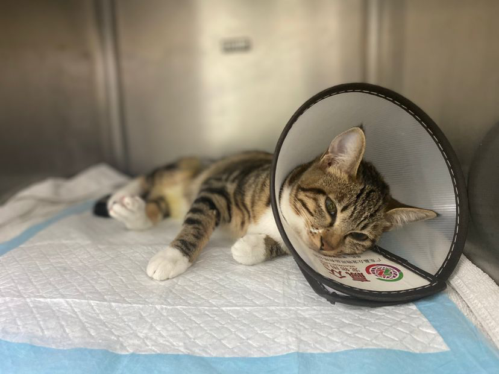
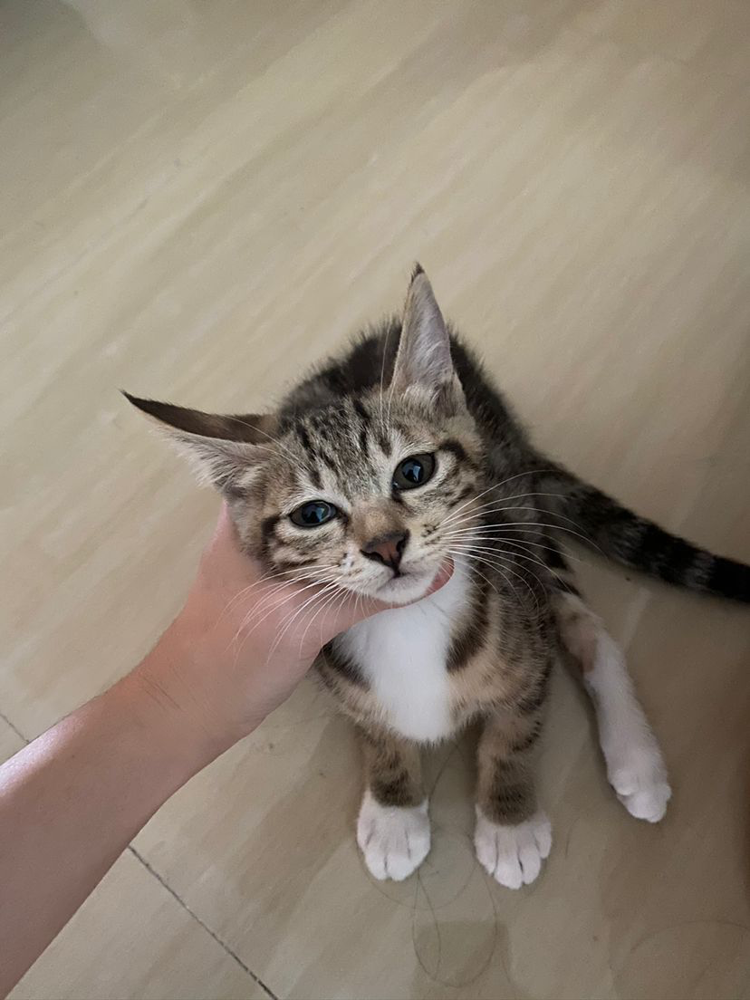

=== Hi there 👋
:emaill: fredsuvn@163.com
:url: https://github.com/fredsuvn
:qq-group: QQ group: 1037555759

image:https://github-readme-stats.vercel.app/api?username=fredsuvn[]
image:https://github-readme-stats.vercel.app/api/top-langs/?username=fredsuvn[]

//**fredsuvn/fredsuvn** is a ✨ _special_ ✨ repository because its `README.md` (this file) appears on your GitHub profile.

//Here are some ideas to get you started:

- 🔭 I’m currently working on:
* link:https://github.com/srclab-projects[SrcLab]: My public projects;
* link:https://github.com/suvn-projects[Suvn]: My personal projects;

- 🌱 I’m currently learning:
* link:https://www.debian.org/[Debian]: My personal server;

- 👯 I’m looking to collaborate on (for a `JOB`)
* `Project Manager` about `java`, `kotlin`, `golang`...
* `Logo Designer`, yes, I love designing;

//- 🤔 I’m looking for help with ...
//- 💬 Ask me about ...

- 📫 How to reach me:
* {emaill}
* {url}
* {qq-group}

//- 😄 Pronouns: ...

- ⚡ Fun fact:
* I have three CATS, and I LOVE them!

image:cats/cats1.png[,360]

